# 星芽奇旅 · Kids Learning Games

一个面向 3-6 岁儿童的离线学习游戏项目。孩子可以在探索地图中完成数学、比较和拼音挑战，也可以进入学习馆认识汉字、英语和古诗，或在放松站玩轻量小游戏。

**项目类型：** React + TypeScript + Phaser + Electron + Capacitor

## 游戏截图

### 探索地图

<p align="center">
	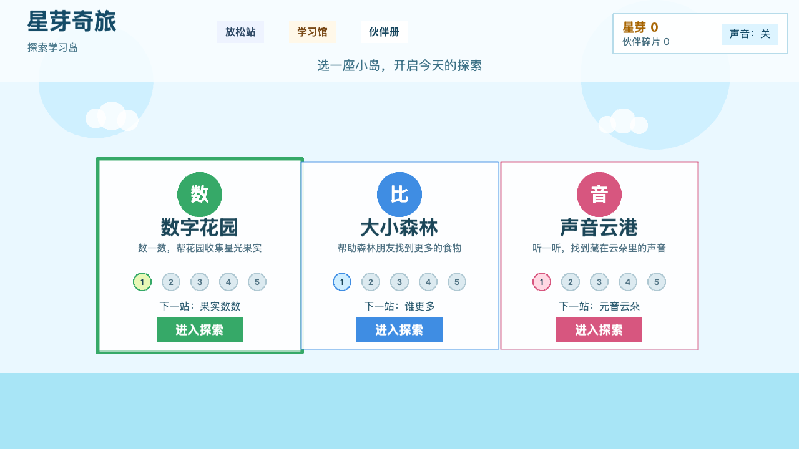
</p>

### 探索学习世界

<p align="center">
	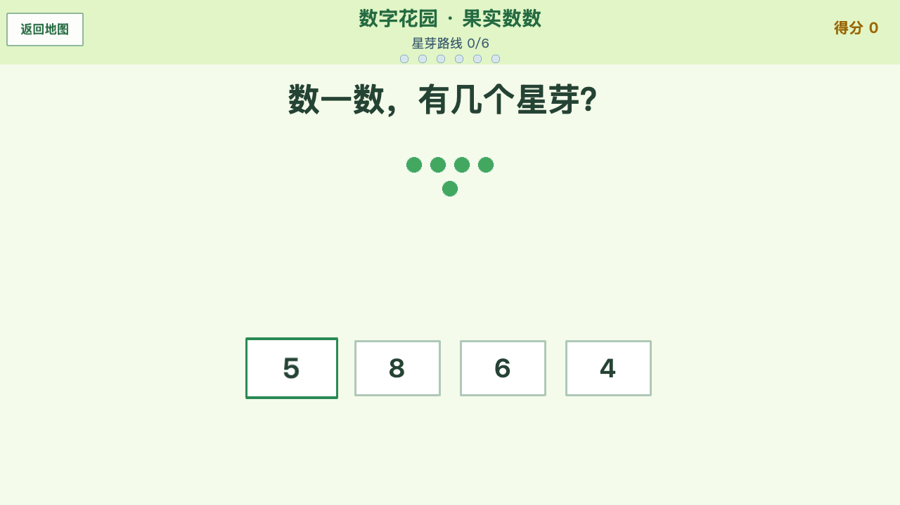
	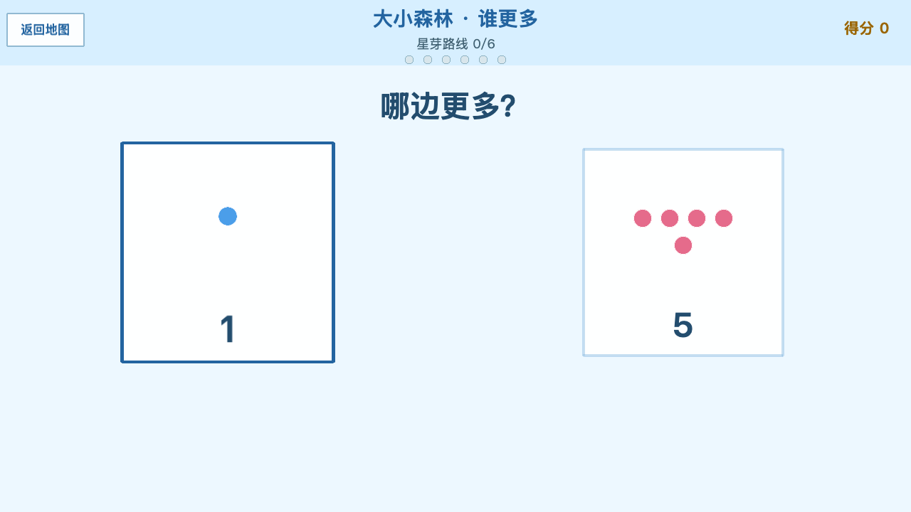
	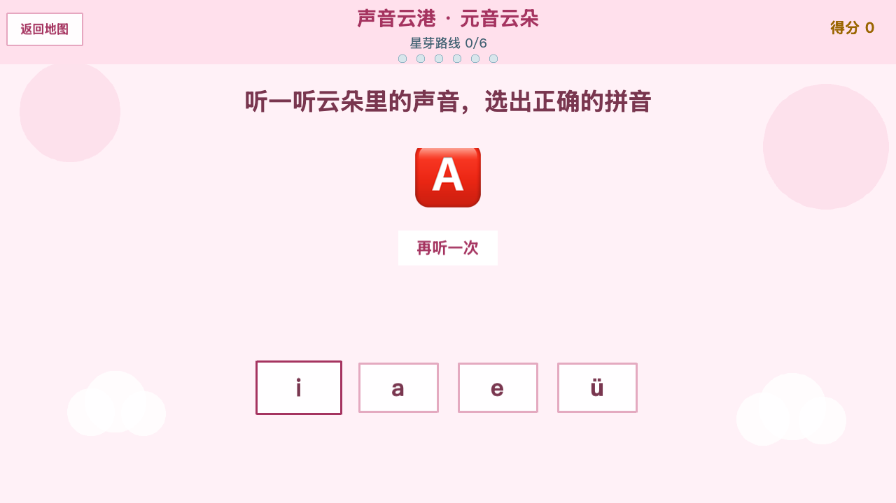
</p>

| 数字花园 | 大小森林 | 声音云港 |
| --- | --- | --- |
| 数数、加法、减法和混合算术 | 更多、更少和三步排序 | 图片线索与拼音辨认 |

### 学习馆

<p align="center">
	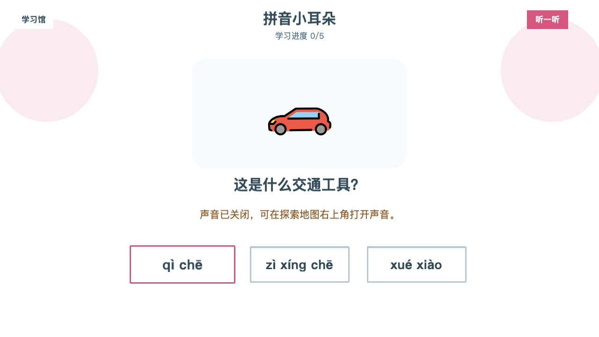
	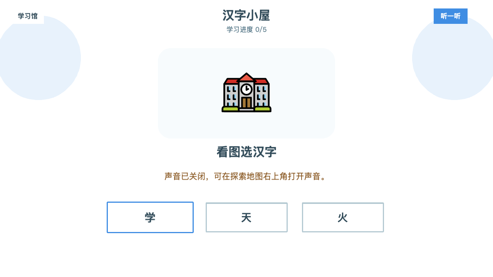
	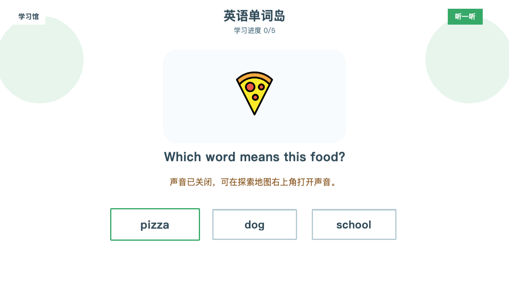
</p>
<p align="center">
	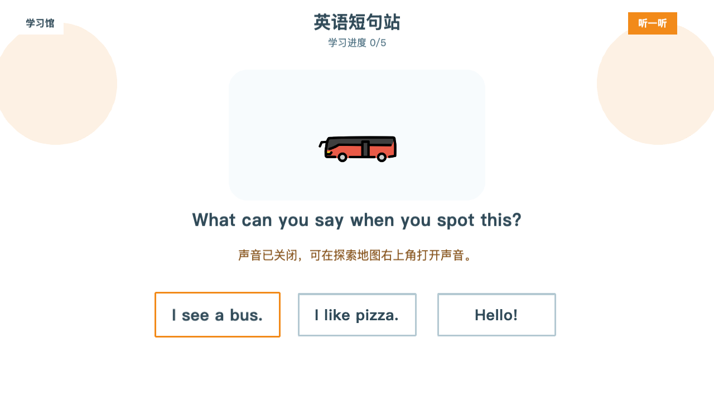
	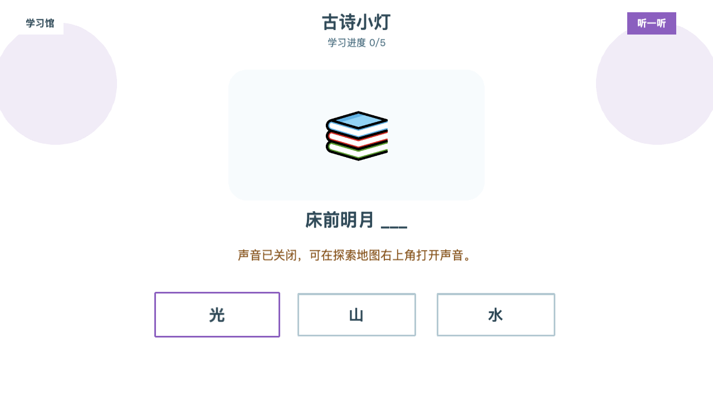
</p>

| 拼音 | 汉字 | 英语单词 | 英语短句 | 古诗 |
| --- | --- | --- | --- | --- |
| 图片与拼音匹配 | 人物、食物、交通、动物和水果等常用字 | 身边物品和动物词汇 | 问候、上学和外出等常用表达 | 名篇名句填空 |

### 放松站

<p align="center">
	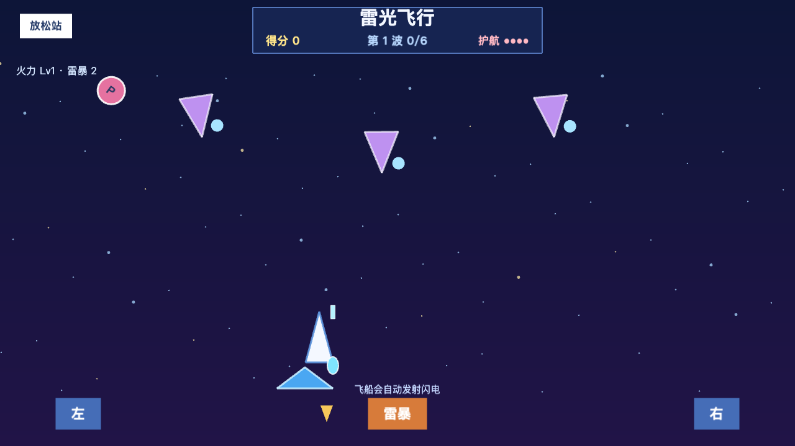
	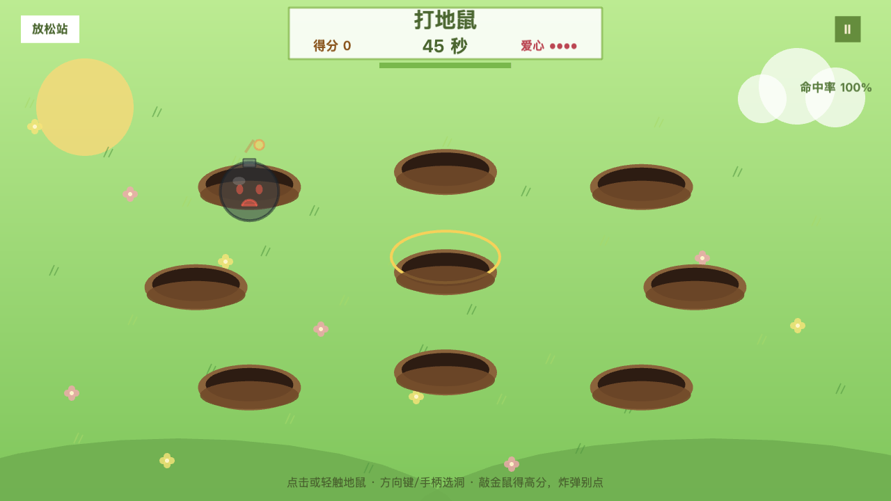
</p>
<p align="center">
	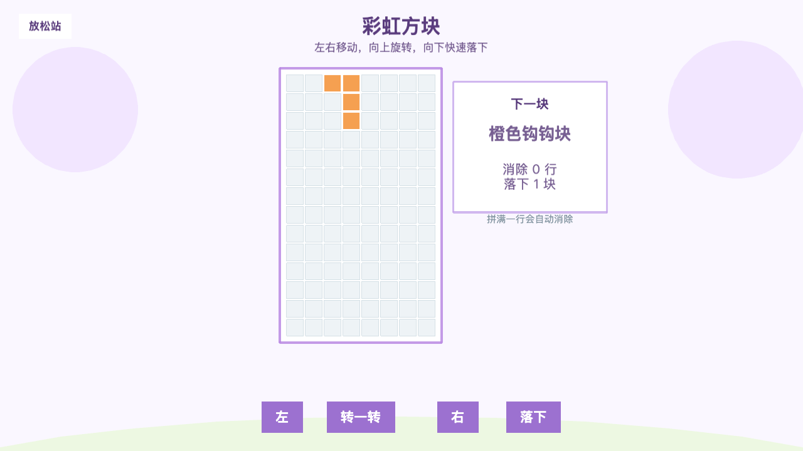
	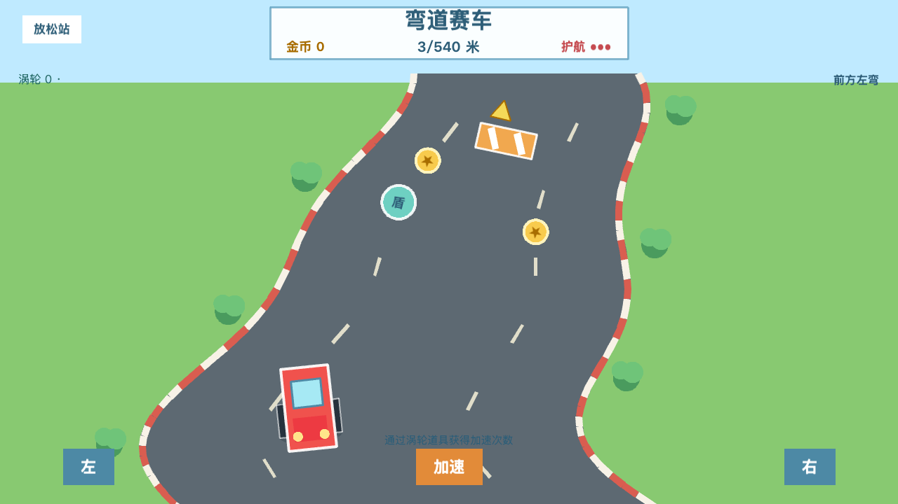
</p>

| 雷光飞行 | 打地鼠 | 彩虹方块 | 弯道赛车 |
| --- | --- | --- | --- |
| 自动射击、三波敌机、护盾/火力/雷暴道具 | 金鼠、头盔鼠、时钟鼠、炸弹和连击 | 移动、旋转和消除彩色方块 | 3D 三车道、交通车流、金币、护盾/吸附/氮气道具 |

## 功能

- 探索地图：三个学习世界各有 5 个节点，每个节点包含 6-10 道挑战。
- 成长反馈：首次完成节点可获得星芽与伙伴碎片；每个世界收集 4 枚碎片可解锁一位伙伴。
- 学习馆：每类练习都有本地图片、三选一题卡、一次温和提示与可选系统朗读。
- 放松站：四种 1-3 分钟的轻量小游戏，支持儿童触控、键盘和手柄操作。

## 隐私与声音

- 无账号、无广告、无社交、无排行榜和无个人信息收集。
- 所有学习进度只保存在当前设备的浏览器本地存储中。
- 游戏默认静音；只有玩家主动打开声音后，学习卡和提示才会使用系统语音朗读。

## 快速开始

要求：Node.js 22 或更高版本、npm。

```bash
npm install
npm run dev
```

默认开发地址为 `http://localhost:3000`。

## 质量检查

```bash
npm run lint
npm run build
npm run test:learning
npm run test:generators
npm run verify:release
```

- `npm run build`：TypeScript 检查和 Vite 生产构建。
- `npm run test:learning`：学习内容、答案选项和本地图片资源完整性检查。
- `npm run test:generators`：随机题目边界检查。
- `npm run verify:release`：检查 npm、Android 和 Apple 的版本号及构建号一致性。
- `npm run dev:electron`：启动 Electron 桌面开发模式。
- `npm run build:electron`：构建当前机器支持的 macOS 与 Windows 桌面包。

## 桌面与移动端构建

桌面端由 Electron 打包，移动端由 Capacitor 复用同一份 React 和 Phaser 游戏代码。iPhone、iPad、Android 手机和 Android 平板均使用横屏界面，并会避开刘海和系统安全区。

```bash
# 桌面端：按目标架构分别打包
npm run build:electron:mac:arm64
npm run build:electron:mac:x64
npm run build:electron:win:arm64
npm run build:electron:win:x64

# 先构建 Web 并同步到两个原生工程
npm run mobile:sync

# 本机原生构建，需要 Android Studio/Java 21 或 Xcode
npm run mobile:android
npm run mobile:ios

# Windows 本机构建 Android 手机/平板通用包
cd android
./gradlew.bat assembleDebug bundleRelease
```

Android 原生工程在 `android/`，iOS/iPadOS 工程在 `ios/App/`。Android 构建需要 JDK 21、Android SDK Platform 36 和 Build Tools 36；第一次打开时可分别使用 Android Studio 和 Xcode 选择模拟器或真机。Android 手机和平板共用一个 APK/AAB，iPhone 和 iPad 共用一个 Universal IPA。正式商店包必须由各自平台的签名证书生成。

## GitHub Actions 发布

`.github/workflows/verify.yml` 会在 `main` 推送和 Pull Request 上运行依赖审计、静态检查、构建、学习内容测试、题目生成测试、无声 UI 回归与 Capacitor 同步检查。

`.github/workflows/build-artifacts.yml` 可在 Actions 页面手动触发，也会在推送与项目版本一致的 `vX.Y.Z` 标签时触发。手动运行只保留 Actions Artifacts；标签运行会创建 GitHub Release，并发布以下文件：

- macOS x64 与 arm64 DMG
- Windows x64 与 arm64 NSIS 安装包
- Android 手机/平板通用 Debug APK 与未签名 Release AAB
- iPhone/iPad 通用未签名 IPA
- 全部发布文件的 `SHA256SUMS.txt`

创建版本并发布：

```bash
npm run verify:release -- --tag v1.0.0
git tag -a v1.0.0 -m "Release v1.0.0"
git push origin v1.0.0
```

当前常规 Release 是跨平台构建验证版本：Windows 与 macOS 包没有商业代码签名；Android Debug APK 使用测试签名，可直接侧载测试，AAB 未签名且不能上传 Google Play；iOS/iPadOS IPA 未签名，只用于检查构建结果，不能直接安装到普通设备。

手动勾选 `sign_ios` 后，工作流会生成可安装的 iOS/iPadOS 签名 IPA。执行前需要在仓库 Secrets 中配置：

- `IOS_CERTIFICATE_BASE64`
- `IOS_CERTIFICATE_PASSWORD`
- `IOS_PROVISIONING_PROFILE_BASE64`
- `IOS_EXPORT_OPTIONS_PLIST_BASE64`

手动勾选 `sign_android` 后，工作流会生成签名 Android APK 与 AAB。执行前需要在仓库 Secrets 中配置：

- `ANDROID_KEYSTORE_BASE64`
- `ANDROID_KEYSTORE_PASSWORD`
- `ANDROID_KEY_ALIAS`
- `ANDROID_KEY_PASSWORD`

未配置这些 Secrets 时，常规构建不会请求签名信息，也不会发布到应用商店。

## 操作

- 鼠标或触摸：点击世界、学习卡、放松游戏和答案。
- 键盘：方向键移动焦点，Enter 确认，Esc 返回，数字键 `1` 至 `4` 选择答案。
- 手柄：方向键选择，A 确认，B 返回；X 打开放松站，Y 打开学习馆，R1 打开伙伴册。
- 雷光飞行：鼠标或手指拖动飞船；方向键或手柄摇杆可做二维移动；空格或 J 使用雷暴。
- 打地鼠：点击或轻触洞口；方向键或手柄选择洞位，Enter/A 敲击。
- 星芽拉力赛：轻触赛道直接选车道；`A`/`D`、方向键或手柄切换车道，空格/Enter/A 使用氮气。

## 素材与第三方声明

学习图片使用 OpenMoji 本地 SVG 素材。执行以下命令可重新下载项目使用的图片：

```bash
npm run assets:learning
```

完整素材归属、许可证与第三方依赖声明见 [THIRD_PARTY_NOTICES.md](THIRD_PARTY_NOTICES.md) 和 [public/assets/openmoji/ATTRIBUTION.md](public/assets/openmoji/ATTRIBUTION.md)。

## 项目结构

- `src/config/`：世界、学习内容和 Phaser 配置。
- `src/scenes/`：探索、学习、伙伴、奖励和放松游戏场景。
- `src/scenes/RelaxationHubScene.ts`、`ThunderFlightScene.ts`、`WhackAMoleScene.ts`、`RainbowBlocksScene.ts`、`TinyRaceScene.ts`：四种放松小游戏；`ThreeRaceRenderer.ts` 提供拉力赛的 Three.js 低多边形 3D 世界。
- `src/store/`：本地进度、星芽、伙伴碎片和音频状态。
- `public/assets/openmoji/`：本地学习图片和许可说明。
- `docs/screenshots/`：README 中使用的真实游戏截图。
- `electron/`：桌面主进程和预加载脚本。
- `scripts/`：素材下载与自动化内容/UI 验证。

## 发布前说明

“星芽奇旅”是当前产品品牌名。正式上架前仍应完成应用商店、域名和商标近似检索。桌面应用标识 `com.kids.learn-game` 暂未变更，以避免已有安装用户的升级路径中断。

移动应用标识为 `com.xingya.kidslearning`。`npm audit --omit=dev` 当前为零漏洞；全量审计仍会报告 Capacitor CLI 的开发期 `xcode -> uuid` 上游告警，Capacitor `8.5.0` 暂无兼容的自动修复。该链不进入浏览器、Electron 或移动端运行时产物，升级 Capacitor CLI 后应重新执行审计。
